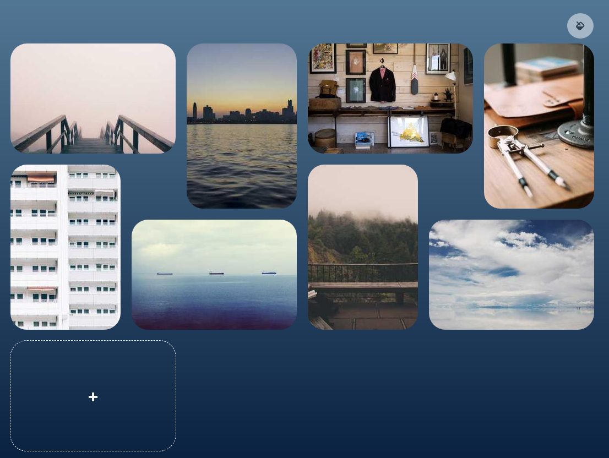

# A random moodboard generator

<!--  -->

### Functionalities

- Get random images from the internet using LoremPicsum API
- Put images on the page in an interesting layout
- Change background color and accent color and save it to local storage
- Switch images you don't like with a nice flip transition

Technologies

- CSS Grid
- CSS Flexbox
- Sass
- LoremPicsum API
- JavaScript DOM manipulation
- Local Storage
